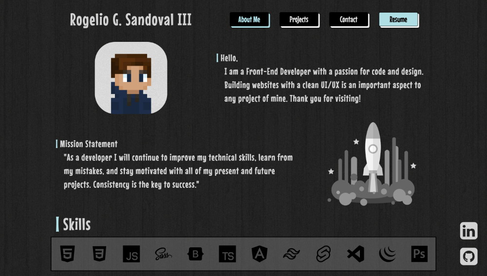

<h1>Portfolio</h1>
<a href="https://rogelio-portfolio.web.app/"><b>Link</b></a>
 
<h3>Framework Used:</h3>

<h3>Languages Used:</h3>

 
 
 
Nothing more than my own personal portfolio, I had a lot of fun making this one. Another great opportunity for me to play around with my creativity, basic transitions, and UI. Thank you for viewing!
 
 

